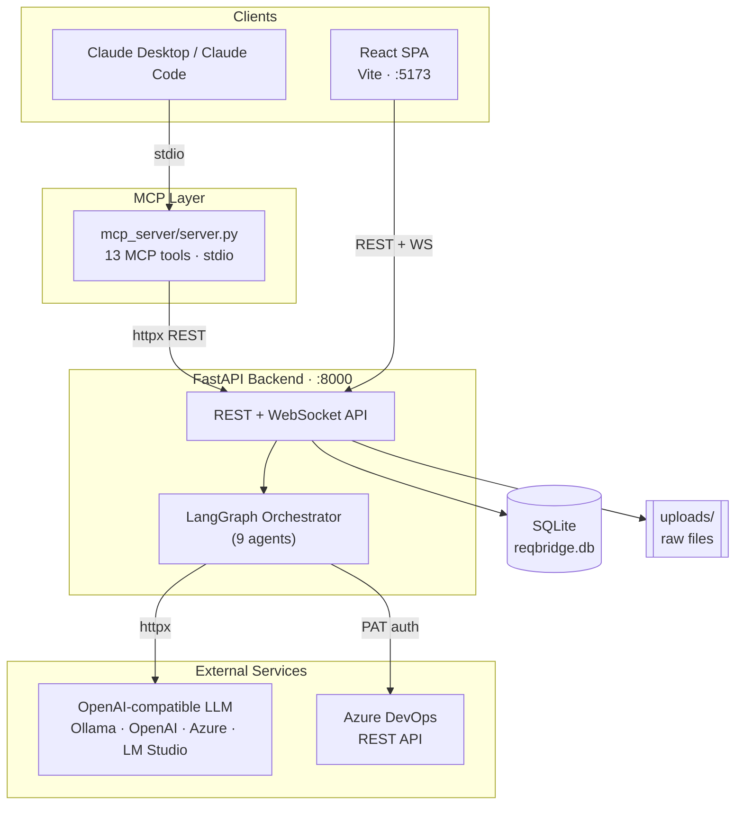
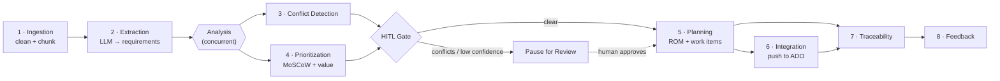
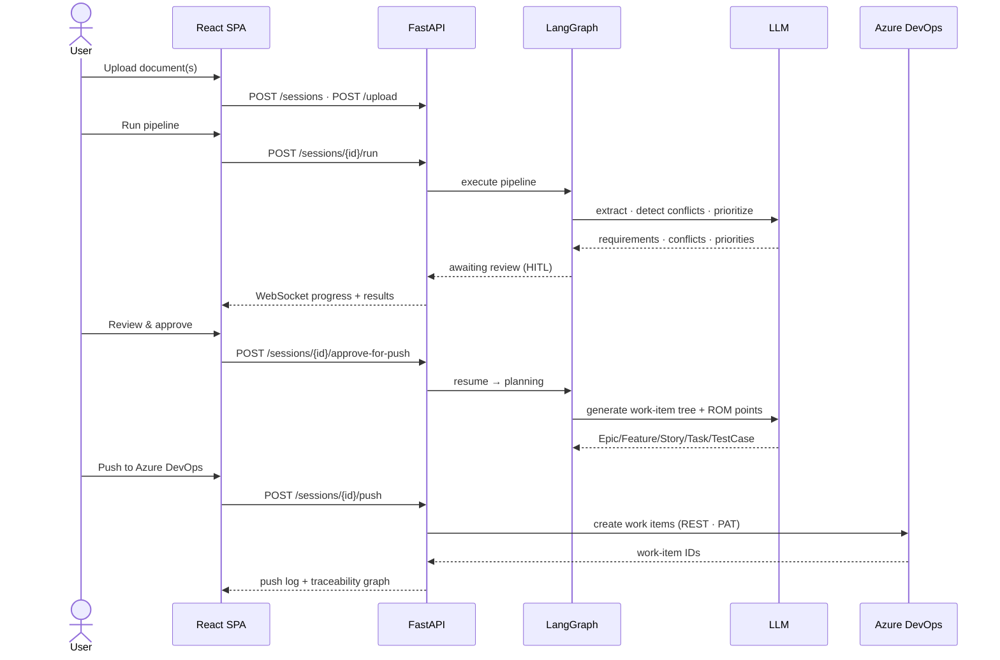
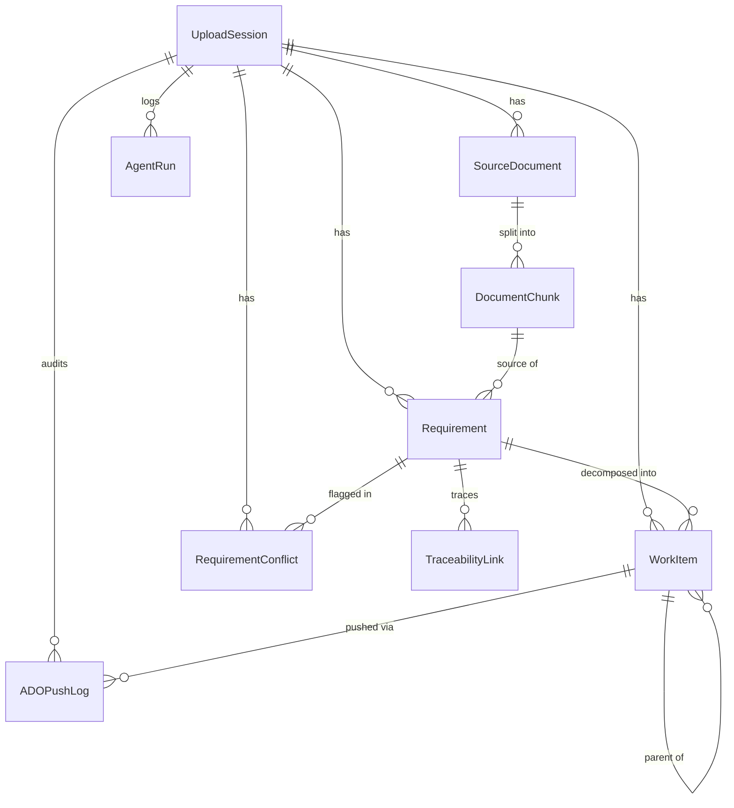
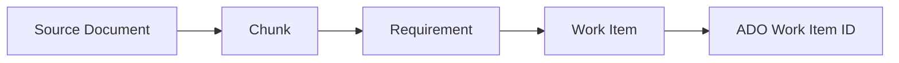

# ReqBridge — AI Requirements Intelligence Engine

**Turn messy requirement documents into structured, prioritized, conflict-checked Azure DevOps work items — with an MCP-native, multi-agent AI pipeline.**

<p align="center">
  
  
  
  
  
  
  
</p>

---

## Overview

**ReqBridge** ingests multi-format requirement documents (PDF, DOCX, XLSX, EML, images via OCR, and plain text) and runs them through a **9-stage [LangGraph](https://langchain-ai.github.io/langgraph/) agent pipeline** that:

1. extracts atomic requirements with confidence scores,
2. detects logical/semantic **conflicts** between them,
3. **prioritizes** them (MoSCoW + business value),
4. pauses for **human-in-the-loop (HITL)** review when confidence is low or conflicts exist,
5. **decomposes** approved requirements into an Epic → Feature → Story → Task → Test Case hierarchy with **ROM (Rough Order of Magnitude) effort scoring**,
6. optionally **pushes** the work items to **Azure DevOps** via the REST API, and
7. maintains a live **traceability graph** linking every source ⇄ requirement ⇄ work item ⇄ ADO ID.

Everything the backend can do is also exposed as **Model Context Protocol (MCP) tools**, so an MCP client such as Claude Desktop can drive the whole pipeline conversationally.

> The LLM is pluggable: ReqBridge talks to **any OpenAI-compatible `/v1/chat/completions` endpoint** (Ollama, OpenAI, Azure OpenAI, LM Studio, llama.cpp, Foundry Local) over plain `httpx` — no SDK lock-in.

---

## Key Features

- **Multi-format ingestion** — PDF, DOCX, XLSX, EML, images (OCR via Tesseract), and text, chunked semantically for extraction.
- **9 specialized agents** orchestrated with LangGraph, with concurrent analysis and per-agent model selection (fast model for extraction, stronger model for reasoning-heavy steps).
- **Conflict detection** in a single batched LLM call (no O(n²) pairwise calls).
- **Human-in-the-loop gate** that halts the pipeline for review when confidence is below a threshold or conflicts are present.
- **Deterministic ROM scoring** — effort is computed in Python from a configurable weight/multiplier model, not hallucinated by the LLM.
- **Azure DevOps integration** — idempotent, hierarchy-aware work-item creation through the ADO REST API (PAT auth); already-pushed items are skipped on re-runs.
- **Live traceability graph** built with NetworkX, with upstream/downstream impact analysis.
- **Three surfaces** — FastAPI REST + WebSocket, a React/Vite SPA, and an MCP server — all backed by the same core.
- **Active-learning feedback loop** — human corrections are logged for prompt/agent improvement.

---

## Architecture



---

## The Agent Pipeline

The pipeline is defined in `backend/app/agents/orchestrator.py`. Conflict detection and prioritization run **concurrently** inside an analysis node; a HITL gate can halt before planning.



| # | Agent | What it does |
|---|-------|--------------|
| 1 | **Ingestion** | De-duplicates and cleans parsed document chunks (no LLM). |
| 2 | **Extraction** | Extracts atomic requirements with confidence scores; runs chunk calls concurrently. |
| 3 | **Conflict** | Detects contradictions between requirements in one batched LLM call. |
| 4 | **Prioritization** | Assigns MoSCoW priority and business-value scores. |
| — | **HITL gate** | Pauses for human review when conflicts exist or confidence < threshold. |
| 5 | **Planning** | Deterministic ROM scoring + LLM generation of Epic/Feature/Story/Task/Test Case. |
| 6 | **Integration** | Creates work items in Azure DevOps (REST, PAT) — idempotent and hierarchy-aware. |
| 7 | **Traceability** | Builds the source ⇄ requirement ⇄ work item ⇄ ADO link graph. |
| 8 | **Feedback** | Records human corrections for future tuning. |

### End-to-End Sequence



---

## Data Model

Persisted in a single SQLite file via SQLAlchemy 2.0 (`backend/app/models.py`).



### Traceability chain



---

## Tech Stack

**Backend (Python 3.11+)**
- FastAPI + Uvicorn, WebSockets, `httpx`
- SQLAlchemy 2.0 (async, `Mapped[T]`) + `aiosqlite`
- LangGraph + langchain-core (pipeline orchestration)
- `mcp` Python SDK (stdio transport)
- Parsing: PyMuPDF, python-docx, openpyxl, Pillow, pytesseract
- NetworkX (traceability graph), Pydantic v2 + pydantic-settings, tenacity
- pytest + pytest-asyncio

**Frontend (Node 20+)**
- React 18 + TypeScript 5 + Vite 5
- Tailwind CSS v3, React Router v6, TanStack Query v5, Zustand
- D3 v7 / Recharts v2 (graph + charts)

**MCP layer**
- `mcp_server/server.py` — stdio MCP server exposing 13 tools.

---

## MCP Tools

The MCP server (`mcp_server/server.py`) exposes the full pipeline to any MCP client:

| Tool | Purpose |
|------|---------|
| `create_session` | Start a new requirements session |
| `upload_document` | Attach a document to a session |
| `run_pipeline` | Execute the agent pipeline |
| `get_pipeline_status` | Poll progress / current agent |
| `get_requirements` | List extracted requirements |
| `get_conflicts` | List detected conflicts |
| `correct_requirement` | Apply a human correction |
| `approve_requirements` | Approve requirements for planning/push |
| `get_work_items` | Retrieve the generated work-item tree |
| `push_to_azure_devops` | Create the work items in ADO |
| `get_traceability` | Fetch the traceability graph |
| `get_session_report` | Render the HTML session/ROM report |
| `list_sessions` | List all sessions |

---

## Project Structure

```
.
├── run.py                       # single-command launcher (backend + frontend)
├── smoke_llm.py                 # LLM connectivity smoke test
├── requirements.txt             # Python dependencies
├── backend/
│   ├── .env.example             # copy → backend/.env
│   └── app/
│       ├── main.py              # FastAPI entry (lifespan, CORS, routers)
│       ├── models.py            # SQLAlchemy ORM models
│       ├── schemas.py           # Pydantic v2 schemas
│       ├── agents/              # 9 LangGraph agents + base + orchestrator
│       ├── api/sessions.py      # REST + WebSocket routes
│       ├── core/                # config, database, time helpers
│       ├── graph/               # NetworkX traceability graph
│       ├── ingest/              # multi-format document parser
│       ├── prompts/             # versioned prompt templates (.txt)
│       └── scoring/             # deterministic ROM engine + HTML reports
├── frontend/
│   ├── .env.example             # copy → frontend/.env (VITE_API_URL)
│   └── src/
│       ├── pages/               # Home, PipelineMonitor, RequirementsReview,
│       │                        #   TraceabilityGraph, ADOPushSync
│       ├── components/          # shared UI
│       └── lib/                 # utilities
├── mcp_server/
│   ├── server.py                # ReqBridge MCP server (stdio)
│   └── claude_desktop_config.example.json
└── research scope/              # research paper scaffold
```

---

## Getting Started

### Prerequisites

| Tool | Version | Why |
|------|---------|-----|
| Python | 3.11+ | Backend + MCP server |
| Node.js | 20 LTS+ | Frontend dev/build |
| An OpenAI-compatible LLM | — | e.g. [Ollama](https://ollama.com) (free/offline) |
| Tesseract | 5.x | *Optional* — OCR for images / scanned PDFs |
| Azure DevOps PAT | — | *Optional* — only to push work items to ADO |

### 1. Backend

```powershell
# From the repo root
Copy-Item backend\.env.example backend\.env      # then edit LLM_* / ADO_* as needed

python -m venv .venv
.\.venv\Scripts\Activate.ps1                       # Windows
# source .venv/bin/activate                        # macOS / Linux
pip install -r requirements.txt
```

Bash equivalent:

```bash
cp backend/.env.example backend/.env
python3 -m venv .venv && source .venv/bin/activate
pip install -r requirements.txt
```

### 2. Frontend

```bash
cp frontend/.env.example frontend/.env
cd frontend && npm install && cd ..
```

### 3. Run

```bash
python run.py          # starts backend (:8000) + frontend (:5173) and opens the browser
```

Or run each surface individually:

```bash
# Backend
python -m uvicorn backend.app.main:app --host 127.0.0.1 --port 8000
# Frontend
cd frontend && npm run dev
# MCP server (normally launched by an MCP client such as Claude Desktop)
python mcp_server/server.py
```

- **UI:** http://localhost:5173
- **API docs (Swagger):** http://localhost:8000/docs

---

## Configuration

Backend settings load from `backend/.env` (`backend/app/core/config.py`). Frontend settings load from `frontend/.env` and must be prefixed `VITE_`.

| Variable | Default | Purpose |
|----------|---------|---------|
| `DATABASE_URL` | `sqlite+aiosqlite:///./reqbridge.db` | SQLAlchemy async DB URL |
| `LLM_BASE_URL` | `http://localhost:11434/v1` | OpenAI-compatible chat-completions base URL |
| `LLM_MODEL` | `llama3.1:8b` | Model id sent in the request body |
| `LLM_API_KEY` | *(empty)* | Bearer/api-key header; empty for local Ollama |
| `LLM_REQUEST_TIMEOUT` | `120` | Seconds |
| `ADO_ORG_URL` | *(empty)* | e.g. `https://dev.azure.com/your-org`. If empty, ADO push is skipped |
| `ADO_PAT` | *(empty)* | Azure DevOps PAT (Work Items: read/write) |
| `ADO_PROJECT` | *(empty)* | Default ADO project name |
| `HITL_CONFIDENCE_THRESHOLD` | `0.7` | Pause for review below this score |
| `AUTO_APPROVE_THRESHOLD` | `0.9` | Auto-approve at/above this score |
| `VITE_API_URL` | `http://localhost:8000` | Frontend → backend base URL (WS derived automatically) |

> **Secrets never live in the repo.** `backend/.env`, the SQLite DB, and `uploads/` are git-ignored. The ADO org/project/area paths in `backend/app/scoring/config/rom_config.yaml` are **placeholders** — replace them with your own ADO classification nodes.

---

## Testing

```bash
.\.venv\Scripts\python.exe -m pytest backend/tests -q
```

Covers the multi-format parser, the traceability graph builder, and API smoke tests.

---

## License

Released under the [MIT License](LICENSE).

---

<p align="center"><em>Built with LangGraph, FastAPI, React, and the Model Context Protocol.</em></p>
